# ToDoList
To-do-List web application

Стэк используемых технологий: ASP.NET (backend), Angular (frontend), SQL Server (Database)

## Гайд по запуску
1. Выпоолнить T-SQL запрос на вашем SQL Server (создает нужную базу данных и таблицу для хранения задач);
2. Запустить Program.cs доменной области API для запуска сервера (http://localhost:5171/);
3. Выполнить команду "ng serve" в папке проекта для запуска клиента (http://localhost:4200);
4. ДОПОЛНИТЕЛЬНО: Запустить Program.cs доменной области Additional для запуска фонового сервиса;
5. ДОПОЛНИТЕЛЬНО: Для запуска юнит-тестов трубуется вручную подготовить базы данных для проверок различных ситуаций и вставить ConnectionString в методы тестов. 

## Описание проекта:
Функционал приложения:
1. Создание, редактирование и удаление информации о задачах (с учетом проверок валидности данных);
2. Cортировка задач (по приоритету, статусу и дате ззавершения);
3. Уведомление пользователей об истекающих задачах с истекающим сроком (менее 8 часов, либо менее 24 часов при высоком приоритете).

## Структура проекта
Доменная область API: содержит логику запуска сервера и обрабаботки внешние http-запросов;
Доменная область Application: Сервисный слой приложения;
Доменная область Core: содержит описание модели приложения;
Доменная область Data: содержит логику для работы с базой данных; 
Доменная область Additional: Консольный проект (Фоновый сервис) для перевода задач в архив;
Доменная область Tests: Юнит-тесты приложения.

## Демонстрация работы:
Главная страница приложения:
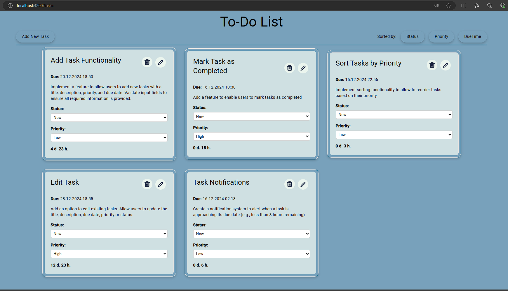

Страница добавления задачи:
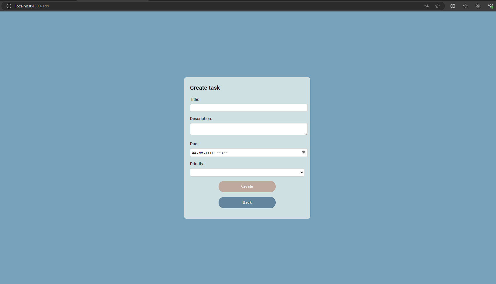

Уведомление о задачах с истекающих сроком (менее 8 часов):
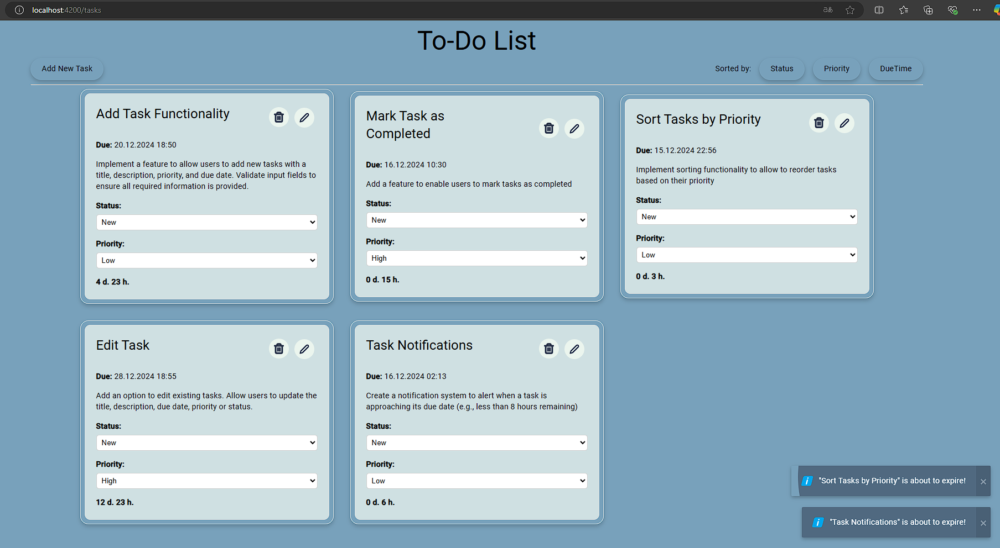

Предупреждение о задачах с высоким приоритетом и с истекающих сроком (менее 24 часов):
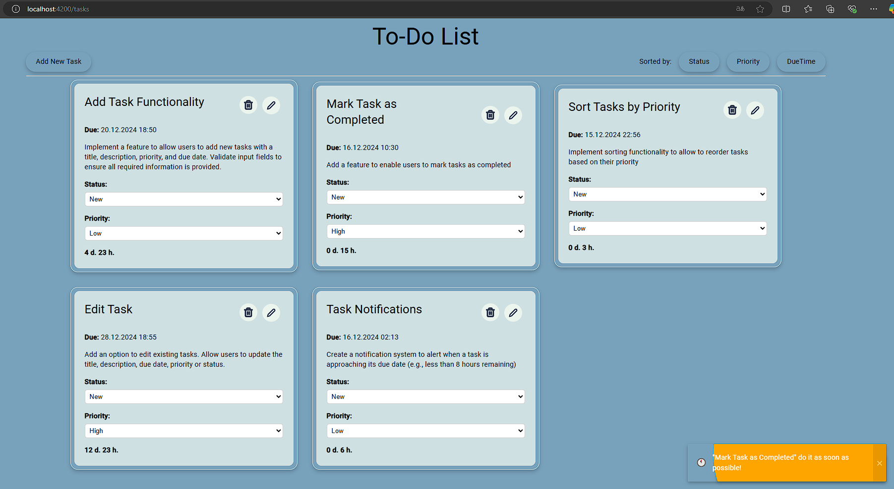

Редактирование:
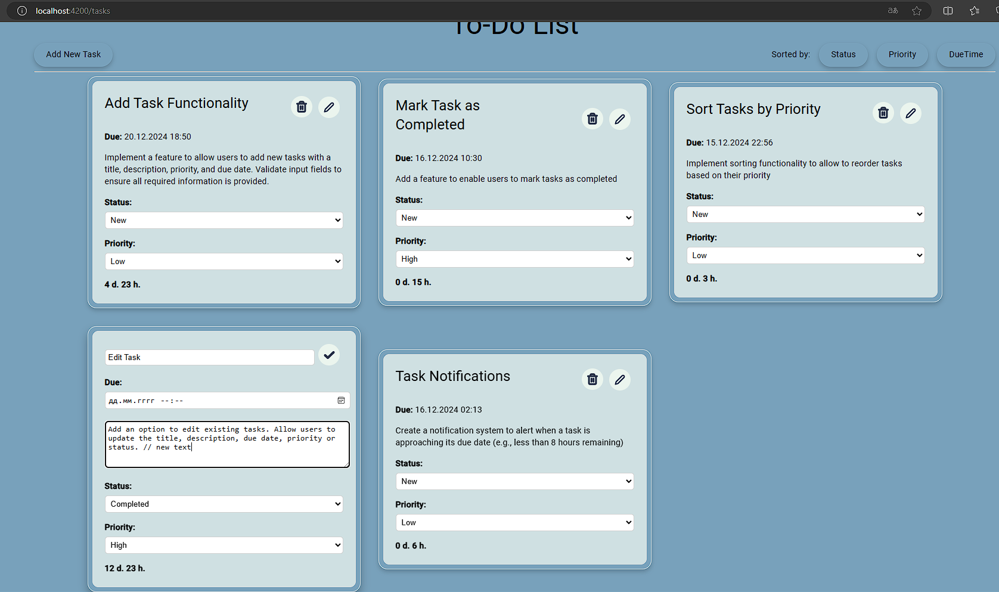

Удаление:
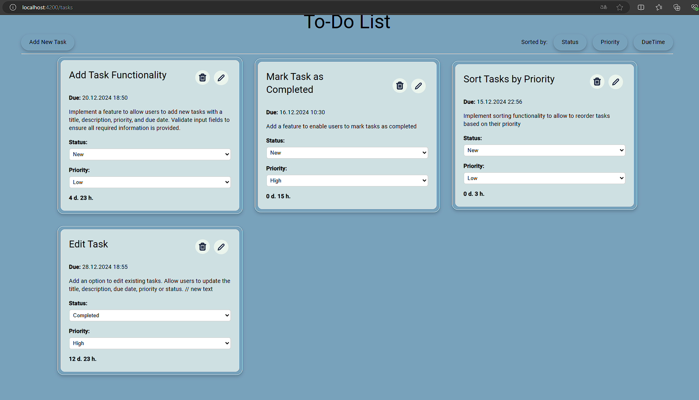

Сортиврока по статусу:
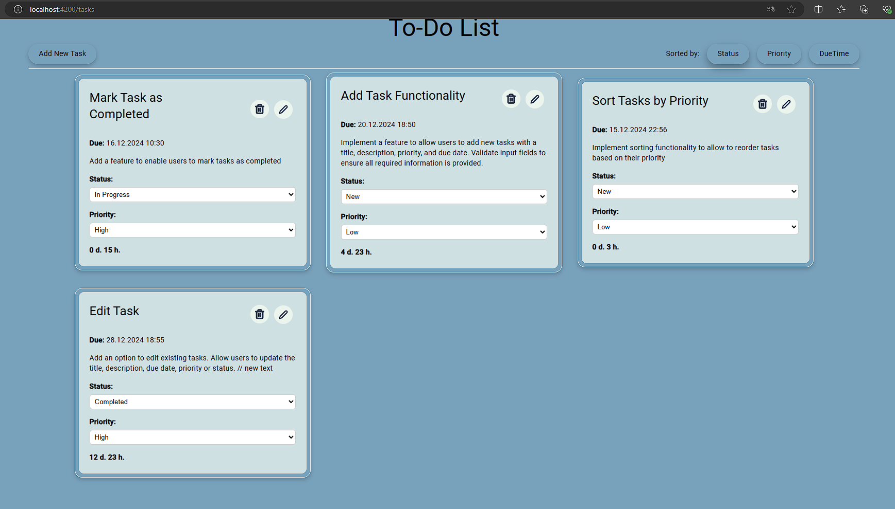

Сортиврока по приоритету:
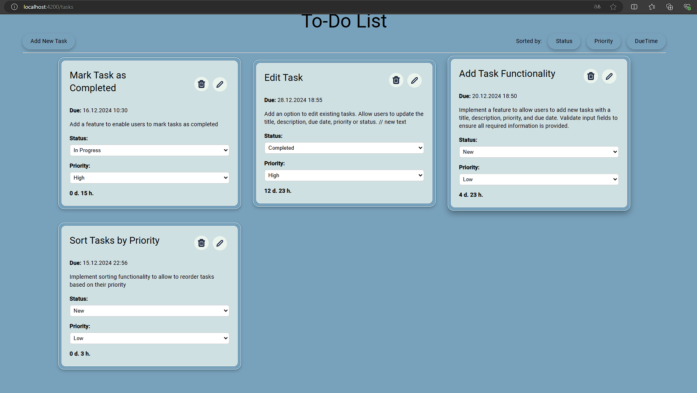

Сортиврока по дате завершения:
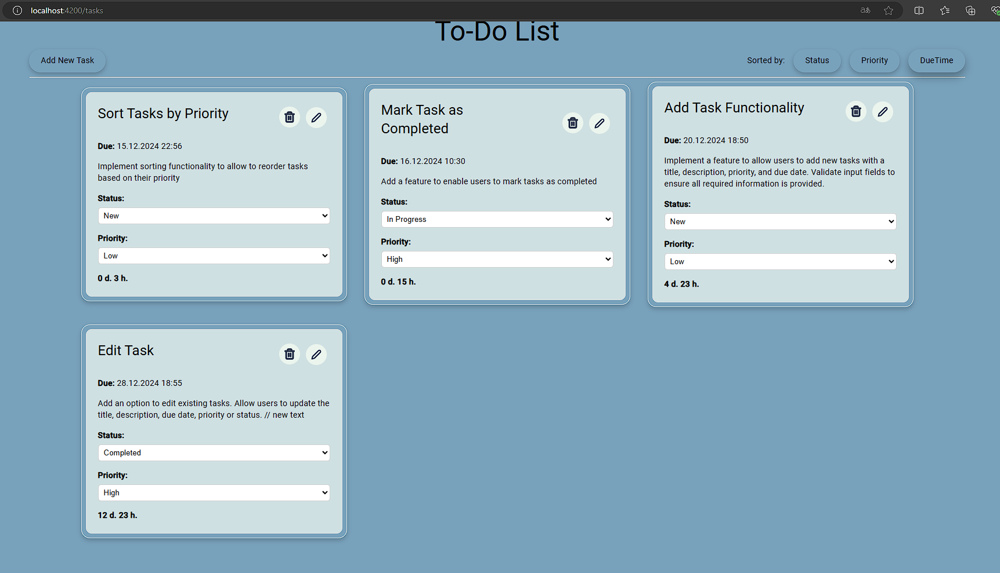

Задачи, которые закончатся в течении часа:
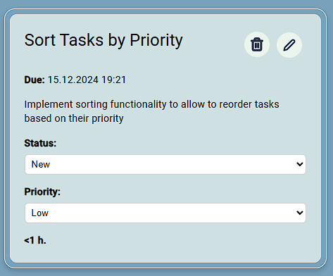

Задачи, которые закончились:
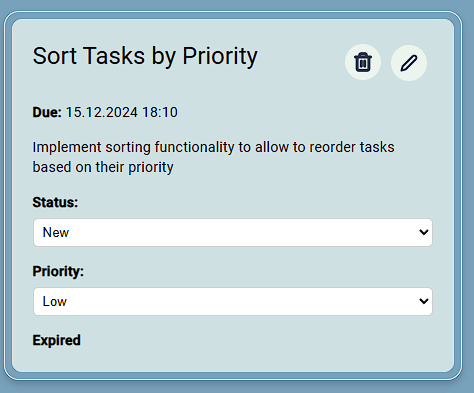

Перевод задач в архив фоновым сервисом:
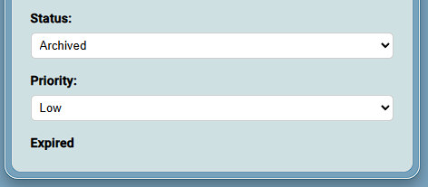
